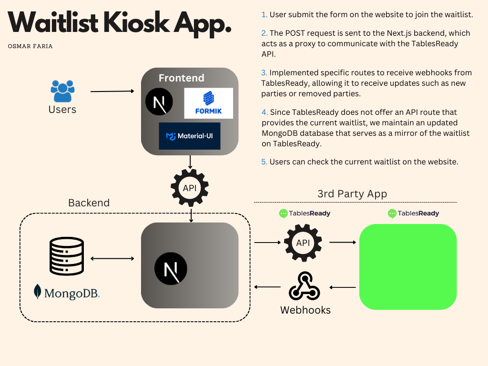

 
## :coffee: Waitlist

This is a compact, full-stack application designed to help businesses manage their waitlist more efficiently. The app uses the TablesReady external API to add users to the waitlist and keep it updated in real-time. However, since TablesReady does not provide a route to access the current waitlist, the app relies on consistent updates through webhooks and the server capabilities of nextjs to ensure the waitlist displayed in the app is always accurate. The webhooks update a parallel MongoDB database, which serves as a backup for the waitlist data and ensures that it is always up-to-date.

The waitlist can be used in a kiosk mode, allowing customers to add themselves to the list. This feature helps businesses automate their waitlist management process, saving time and resources. 

> Check the deployed [app](https://waitlist-redumbrella.vercel.app/).

## Architecture

## 💭 Features

:heavy_check_mark: The app uses webhooks to automatically update the internal waitlist whenever changes are made through the TablesReady external API.\
:heavy_check_mark: The app includes a Vercel cron job that automatically resets the waitlist at the end of each day.

## 💻 Tech stack

     
