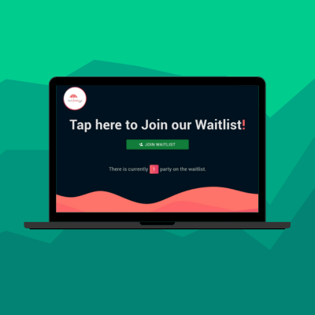

 
## :coffee: Waitlist

This is a mini full stack application, to add users to wait list using TablesReady external API. 

> Check the deployed [app](https://waitlist-redumbrella.vercel.app/).

## 💭 Features

:heavy_check_mark: update internal waitlist through webhooks\
:heavy_check_mark: vercel cron job to reset the waitlist daily

## 💻 Tech stack

     
